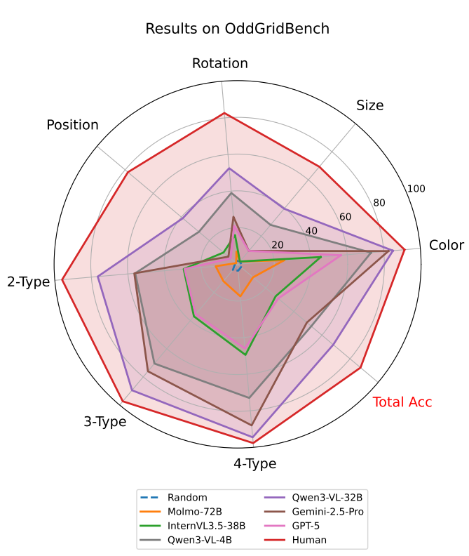
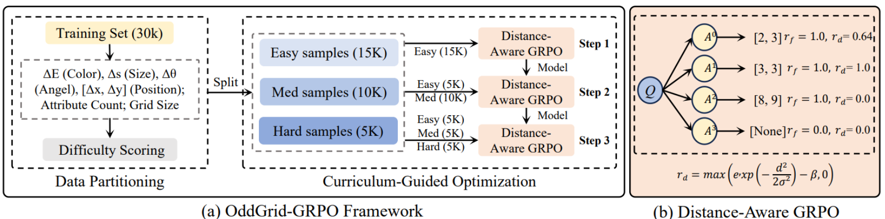

# OddGridBench: Exposing the Lack of Fine-Grained Visual Discrepancy Sensitivity in Multimodal Large Language Models

🚀 **New!** Our paper **"OddGridBench: Exposing the Lack of Fine-Grained Visual Discrepancy Sensitivity in Multimodal Large Language Models"** has been **accepted to CVPR 2026**! 🎉  
This repository contains the official evaluation code and data for our work.


📚 Read the paper: [arXiv PDF](https://arxiv.org/pdf/2603.09326) | [arXiv Page](https://arxiv.org/abs/2603.09326)

🌐 [**Project Homepage**](https://wwwtttjjj.github.io/OddGridBench/)  

📊 [**HuggingFace Dataset**](https://huggingface.co/datasets/wwwtttjjj/OddGridBench)

🤖 [**HuggingFace Model**](https://huggingface.co/wwwtttjjj/OddGrid-GRPO)

## Introduction

MLLMs have achieved remarkable performance across a wide range of vision-language tasks. However, their ability in low-level visual perception, particularly in detecting fine-grained visual discrepancies, remains underexplored and lacks systematic analysis.In this work, we introduce **OddGridBench**, a controllable benchmark for evaluating the visual discrepancy sensitivity of MLLMs. OddGridBench comprises over **1,400 grid-based images**, where a single element differs from all others by one or multiple visual attributes such as **color, size, rotation, or position**. Experiments reveal that all evaluated MLLMs—including open-source families such as **Qwen3-VL** and **InternVL3.5**, and proprietary systems like **Gemini-2.5-Pro** and **GPT-5**—perform far below human levels in visual discrepancy detection.We further propose **OddGrid-GRPO**, a reinforcement learning framework that integrates **curriculum learning** and **distance-aware reward**. By progressively controlling the difficulty of training samples and incorporating spatial proximity constraints into the reward design, OddGrid-GRPO significantly enhances the model’s fine-grained visual discrimination ability. We hope **OddGridBench** and **OddGrid-GRPO** will lay the groundwork for advancing perceptual grounding and visual discrepancy sensitivity in multimodal intelligence.

## Dataset Creation

OddGridBench is designed to systematically evaluate the visual discrepancy sensitivity of multimodal large language models in a controlled and interpretable setting. The benchmark consists of over **1,400 grid-based images**, where most elements follow a shared visual pattern and only one element deviates from the others. The discrepancy can arise from one or multiple visual attributes, including **color, size, rotation, and position**, enabling fine-grained assessment of perceptual sensitivity under varying difficulty levels. Please refer to our huggingface [**🤗 Dataset**](https://huggingface.co/datasets/wwwtttjjj/OddGridBench) for more details.

## Load Dataset

```python
from datasets import load_dataset

# Login using e.g. `huggingface-cli login` to access this dataset
ds = load_dataset("wwwtttjjj/OddGridBench")
```

## Load Model

```python
from transformers import AutoModelForCausalLM, AutoTokenizer

model_name = "wwwtttjjj/OddGrid-GRPO"

tokenizer = AutoTokenizer.from_pretrained(model_name)
model = AutoModelForCausalLM.from_pretrained(
    model_name,
    torch_dtype="auto",
    device_map="auto"
)
```

## Evaluation

Please refer to our [eval](eval) folder for more details.



## Training

Please refer to our [train_configs](train_configs) folder for more details.

## Disclaimers

OddGridBench consists of grid-based images generated from icon assets and programmatic rendering.  We have made every effort to ensure that all visual assets used in this project comply with applicable copyright and licensing requirements. If you are the copyright holder of any asset used in this benchmark and believe that its usage conflicts with your licensing agreement, please [contact](#contact) us directly. 
We will promptly review the request and take appropriate action if necessary.

## Contact

- Tengjin Weng: wtjdsb@gmail.com
- Wenhao Jiang: cswhjiang@gmail.com

## Citation

**BibTeX:**
```bibtex
      @inproceedings{weng2026oddgridbench,
      title={OddGridBench: Exposing the Lack of Fine-Grained Visual Discrepancy Sensitivity in Multimodal Large Language Models},
      author={Weng, Tengjin and Jiang, Wenhao and Wang, Jingyi and Li, Ming and Ma, Lin and Ming, Zhong},
      booktitle={Proceedings of the IEEE/CVF Conference on Computer Vision and Pattern Recognition (CVPR)},
      year={2026}}
```
